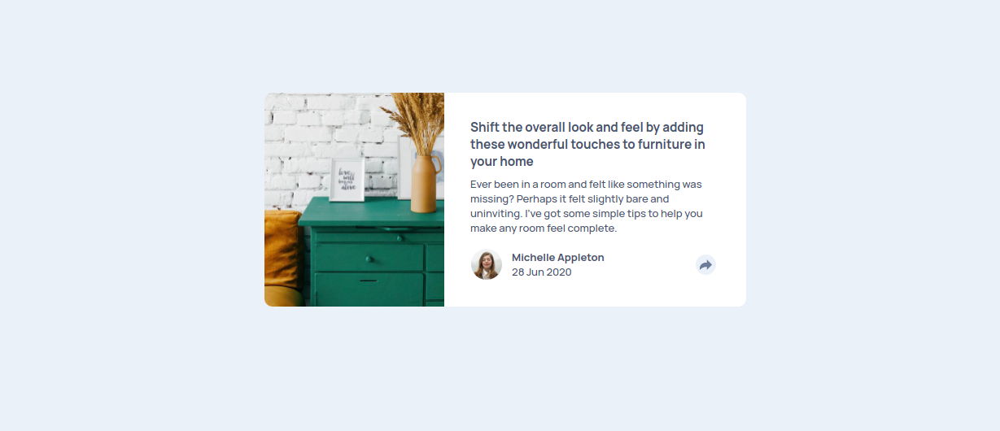
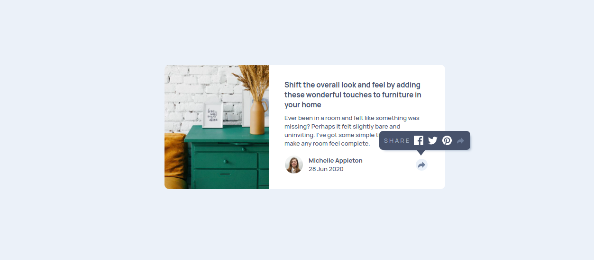

# Frontend Mentor - Article preview component solution

This is a solution to the [Article preview component challenge on Frontend Mentor](https://www.frontendmentor.io/challenges/article-preview-component-dYBN_pYFT). Frontend Mentor challenges help you improve your coding skills by building realistic projects. 

## Table of contents

- [Overview](#overview)
  - [The challenge](#the-challenge)
  - [Screenshot](#screenshot)
  - [Links](#links)
- [My process](#my-process)
  - [Built with](#built-with)
  - [What I learned](#what-i-learned)
  - [Useful resources](#useful-resources)
- [Author](#author)

## Overview

### The challenge

Users should be able to:

- View the optimal layout for the component depending on their device's screen size
- See the social media share links when they click the share icon

### Screenshot

First look of the component

After click share icon

### Links

- Solution URL: (https://github.com/Mlowegene/Article-preview-component)
- Live Site URL: (https://mlowegene.github.io/Article-preview-component/)

## My process

### Built with

- Semantic HTML5 markup
- CSS custom properties
- Flexbox
- Javascript

### What I learned

I have learned to use Javascript events...

### Useful resources

- [javascript events listeners](https://www.youtube.com/watch?v=XF1_MlZ5l6M) - This helped me for undestanding events listeners. I really liked this pattern and will use it going forward.

## Author

- Website - [Mlowegene](https://github.com/Mlowegene)
- Frontend Mentor - [@Mlowegene](https://www.frontendmentor.io/profile/Mlowegene)
- Twitter - [@genemlowe](https://twitter.com/genemlowe)

